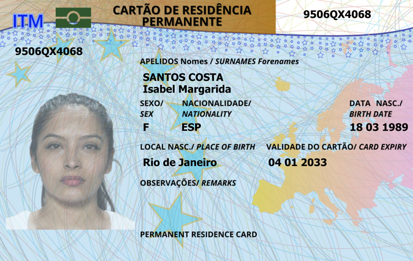
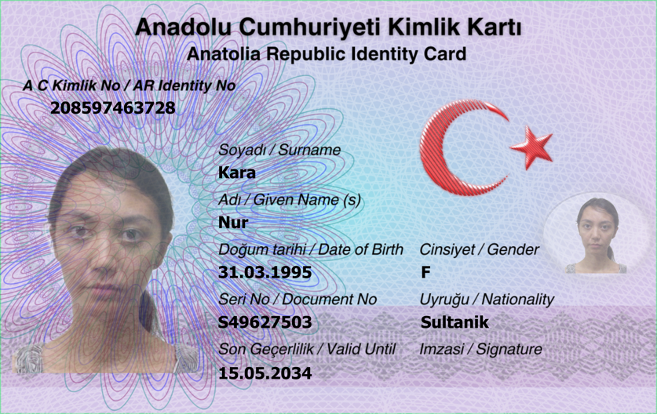

# 🆔 DeepID: Digital Manipulation Detection in ID Documents

## 1️⃣ Overview & Motivation

With the advancements and wide spread of **visual generative models**, ID document tampering has become a pressing issue. **DeepID** is **the first competition** that challenges participants to detect synthetic manipulations (i.e., injection attacks (not presentation attacks)) in **ID documents**. 
### The core objectives are:

- ✅ **Detecting face-swapping manipulations** when it was replaced using face swapping method in an ID document (card or passport).  
- ✅ **Detecting full or partial text inpainted** inside a textual fields of an ID documents, such as, names and dates, using diffusion-based or other generative techniques.
- ✅ **Performing automated visual forensics:**  binary classification and localization of forgeries in tampered ID documents.
- ✅ **Considering practical deployment** with hardware and software limitations in memory and computational resources for ID forgery detection systems.

---

## 2️⃣ Competition Tracks

### 🔹 Track 1: Binary Classification (Real vs. Forged)

- **Input**: A single ID card image  
- **Output**: A score between 0 and 1  
  - Closer to 1: bonafide (real)  
  - Closer to 0: forged  
- **Evaluation**: F1-score (with a fixed threshold at 0.5)  
  F1 detection score is computed on the dataset from the predicted scores of each image using the `f1_score` function from scikit-learn as follows: `f1_score(labels, pred_labels, average='weighted')`. This means the F1-score is weighted per class (bonafide and attack), which is suitable for unbalanced data. A decision threshold of 0.5 is used, where 1 represents bonafide and 0 represents an attack.

---

### 🔹 Track 2: Manipulation Localization (Binary Mask Prediction)

- **Input**: A single ID image  
- **Output**: A binary mask with the same dimensions as the input  
  - Value 1: bonafide (clean)  
  - Value 0: forged/manipulated region  
- **Evaluation**: Image-level aggregated F1-score  
  F1 localization score is computed for each image independently as follows:  
  - If the sample is bonafide:  
    - The entire image is expected to be 1 (no altered regions). Bonafide pixels are positives, and zeros are negatives.  
    - `tp = np.sum(mask == 1)` (all pixels should be 1s in the mask)  
    - `fn = np.sum(mask == 0)` (any zeros are falsely detected as negatives)  
    - `tn = 0`, `fp = 0`  
  - If the sample is an attack:  
    - `tn = np.sum(mask * gt_mask)`  
    - `tp = np.sum((~mask) * (~gt_mask))`  
    - `fp = np.sum((~mask) * gt_mask)`  
    - `fn = np.sum(mask * (~gt_mask))`  
  - Precision = `tp / (tp + fp + 1e-8)`  
  - Recall = `tp / (tp + fn + 1e-8)`  
  - F1 = `2 * precision * recall / (precision + recall + 1e-8)`  
  The final F1-score is the mean of two F1-score means computed for each bonafide and attack class: `(mean(bonafide_f1_scores) + mean(attack_f1_scores)) / 2`, ensuring that the class with more samples does not dominate the final F1-score.  
 - The aggregate F1-score is computed as a weighted average of the F1-scores on the Fantasy ID cards test set and the Private set of real documents: `f1_fantasy * 0.3 + f1_private * 0.7`, emphasizing the importance of the Private set.

---

## 3️⃣ Dataset Overview

### 🧾 Fantasy ID Dataset (for training/tuning)

- **262 fantasy ID templates**, designed to mimic real ID documents of 10 countries  
- **786 bona fide images** captured using:
  - iPhone 15 Pro  
  - Huawei Mate 30  
  - Kyocera TASKalfa 2554ci scanner  
- **1,572 manipulated samples** created using:
  - 2 face-swapping techniques  
  - 2 text inpainting techniques  
- Faces are taken from public datasets:
  - AMFD, Face London, HQ-WMCA  
- Dataset will be released in **August 2025** under **CC BY 4.0**

---

## 4️⃣ Test Sets

### 🔸 In-domain Test Set

- Based on **new Fantasy ID cards**  
- Includes **novel manipulation techniques** not present in training  
- Evaluation leaderboard updated **daily**

### 🔸 Private Out-of-domain Test Set (Hidden)

- Provided by **PXL Vision** using **real ID documents** and corresponding forgeries  
- **Not publicly released**  
- Used for realism & generalization evaluation  
- Leaderboard updated **daily**

---

## 	5️⃣ Fantasy ID Dataset Examples

### 🟩 `original`
Original digital Fantasy ID card designs (before printing/scanning).

|Chinese | Portugal | Turkiye |
|----------|----------|----------|
|  |  |  |

---

### 🟦 `bonafide` 

Captured from printed ID cards using different devices.

#### 📱 iPhone 15 Pro

|Chinese | Portugal | Turkiye |
|----------|----------|----------|
|  |  |  |

#### 📱 Huawei Mate 30

|Chinese | Portugal | Turkiye |
|----------|----------|----------|
|  |  |  |

#### 🖨️ Kyocera TASKalfa 2554ci

|Chinese | Portugal | Turkiye |
|----------|----------|----------|
|  |  |  |

---

### 🟥 `attack` (Digital Manipulations)

Manipulations include face-swapping and text inpainting.

---
#### 🔺 Digital Manipulations-1

##### 📱 iPhone 15 Pro

|Chinese | Portugal | Turkiye |
|----------|----------|----------|
|  |  |  |

##### 📱 Huawei Mate 30

|Chinese | Portugal | Turkiye |
|----------|----------|----------|
|  |  |  |

##### 🖨️ Kyocera TASKalfa 2554ci

|Chinese | Portugal | Turkiye |
|----------|----------|----------|
|  |  |  |

---
#### 🔺 Digital Manipulations-2

##### 📱 iPhone 15 Pro

|Chinese | Portugal | Turkiye |
|----------|----------|----------|
|  |  |  |

##### 📱 Huawei Mate 30

|Chinese | Portugal | Turkiye |
|----------|----------|----------|
|  |  |  |

##### 🖨️ Kyocera TASKalfa 2554ci

|Chinese | Portugal | Turkiye |
|----------|----------|----------|
|  |  |  |

---

<!-- ## 📊 Final Scoring (Aggregate F1 Score)

Final ranking uses a **weighted F1 score** formula:

$$
\text{Aggregate\_F1} = 0.3 \times \text{F1}_{\text{fantasy}} + 0.7 \times \text{F1}_{\text{private}}
$$

Where:

- `F1_fantasy` = average of F1 on bona fide and attack samples from the Fantasy test set  
- `F1_private` = F1-score on the private real document test set   -->
